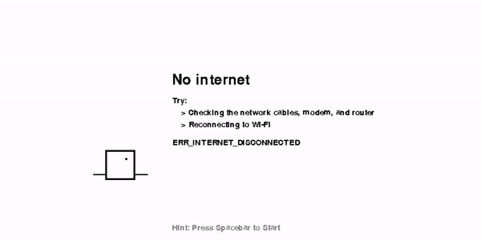

# BLOCK-RUN
  ---
## Game Intro
 Do you love when your internet goes out so that you can play T-Rex Run on google chrome but hate that the graphics are so high that they end up giving you a migraine? Well then this game is for you! 
 
 BLOCK RUN brings all your favorite features of Google Chrome's T-Rex Run such as; Block dinosaur (just a block), block cactuses, a beautiful block landscape, and more. BLOCK RUN has all the classical features you love, with none of the annoying graphics.

---
## About
#### General
BLOCK RUN is a time survival game. The objective is to avoid incoming obstacles (cacti) by jumping over them. The score increments the longer you stay alive and at a steady rate. As your score increases you will find that the difficulty level increases through faster cactus generation and movement speed.

#### This version - 1.0.0
This version contains most of the basics from the original game. What is missing that will come in future versions are:
* Flying "birds" (most likely triangles in this case...) that act as additional obstacles and appear at a certain score level.
* A cyclical shift from day time to night time.

#### Comparison
If you haven't yet stumbled upon Google Chrome's hidden game (unlikely) or would like to see the comparison upon which this game was based, [you can play it here.](http://www.trex-game.skipser.com/)

---
## Demo


---
## How-To-Play
#### Installation
This game was written using Python version 3.8.2 and pygame version 1.9.6. In order to install this version of pygame, type within your command prompt:
```bash
    pip install pygame==1.9.6
```
If you already have another pygame version installed, the code may run fine, but backwards compatibility has not been tested. 

After installation, download or clone this repository to your own machine.

#### Get Playin'
In order to start playing the game you need to be running python in the directory within which the game is located (be sure to have all the auxillary files containing the sound, etc. in that location as well). Simply import the module and use:

Operating from the command simply type:
```python
>>> python main.py
```
NOTE: Your python command may vary. In some cases it may be "python3" rather than just "python"

#### Keys
This highly complex game is not for the feable-minded. So tred carefully while glancing over the following game-play instructions...
| Action | Key |
|--------|-----|
| jump | spacebar |

And that's it! Stunningly easy, I know...

A few things to note; 1) The spacebar does have a time-sensitive aspect (all jumps are not created equal). The longer you hold the spacebar the more lasting your jump will be until gravity completely overtakes you. 2) The space bar is on auto-jump. If you don't cease holding down the spacebar, your player will jump again automatically. 

Both of these features were present in the original T-Rex Run!

#### Settings
##### Game Constanst
All constant game settings are located in settings.py. The three constants, located in this file, that will impact the game the most upon altering are:
* PLAYER_JUMP - decrease this to increase the player's jumping height
* GRAVITY - increase this to accelrate faster to the ground
* ANTI_GRAVITY - This is the spacebar feature mentioned above. Decreasing will allow holding the spacebar to have a greater effect and will increase the feeling of floating. Careful though... if you exceed the magnitude of gravity then there will be no coming back down to earth
##### In-Game variable settings
The most important variables in terms of altering difficulty are:
* self.obs_gen_time (located in main.py) This variable is steadly diminished over time in the update() section of the game loop
* self.velocity & self.vel_chng_rt variables located in sprites.py, under the Obstacles class. These variables control the obstacles speed and rate of change respectively. 
